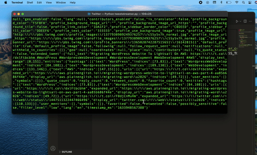

<h1> Real-time Data processing pipeline for Twitter </h1>

Python script consume data from Twitter streaming API using Tweepy library

The data is then pushed into AWS firehose data delivery stream,  
firehose is used for loading streaming data into data lakes such as S3, Amazon Redshift, Amazon OpenSearch
<h2> Architecture : </h2>

Firehose then push data to AWS Opensearch!

Opensearch (Elastic search) is used for analysis and visualisation of data using Kibana
<h2> Kibana visualisation dashboard</h2>

 

